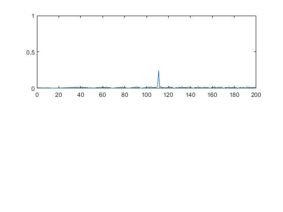
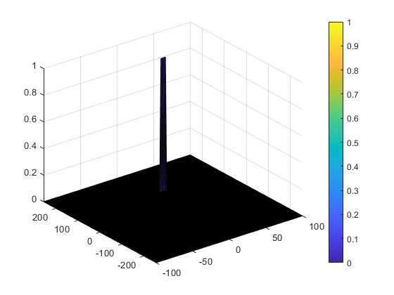

# RadarTargetDetection
## Overview 
In this project it was generated a [FMCW Waveform](https://en.wikipedia.org/wiki/Continuous-wave_radar) using a beat signal with the following properties,


and simulated as follows:


Using this simulated signal, an initial object was set on initial range of 110m and initial velocity 20 m/s.
The next steps are the computation of range and velocity in real time of the target object. For this purpose, the following algorithms will be implemented during this project:
* FFT (Fast fourier transform): computation of range in real time
* 2D FFT: computation of range doppler map
* 2D CFAR: noise filtering to find the object peak velocity 

The pipeline can be summed up in the following description:


## Implementation of FMCW waveform 

Using the defined initial range and velocity, we can compute the range through time,

```
rt= t*v_init + initial_target_range
```
In order to compute the delay time, considering it is a rounding trip with electromagnetic wave (speed of light c ), it can be computed as:
```
td= rt*(2/c)
```
Considering a sinusoidal wave with frequency fc (77GHz) and time delay previously computed, beat signal is generated as follows:
```
Beat= cos(2*pi*(fc*t +Slope*t*t/2)) *cos(2*pi*(fc*(t-td) +Slop*(t-td)*(t-td)/2)) 
```

## Implementation of FFT 
The implementation of FFT is described as follows:
* Reshape Beat signal to matrix size [Nr,Nd] (Nd is the number of chirsp: Nr is the number of samples per chirp)
* Apply FFT transform to previously computed Beat signal and normalize it by Nr
* The FFT signal is a complex number, lets take the absolute value of it 
* In addition, the previously result is symmetric let's take only the positive frequency part 

The final result is the following: 



As it is expected it peaks at 110m, which corresponds to the initial object range.


## Implementation of 2D CFAR


1. Selecting the number of training cells (Tr;Td) as well as guard cells guard_r and guard_d (the index d and r corresponde doppler and range from Range-Doppler map)
* The selected parameters were: Tr=8 ; Tr=4; guard_r= 8 ; guard_d=4; snr = 5 dBm.
* The reason behind this selection is just a symmetric generalization of 1D CFAR during the class as well for iteration process was the minimum size to form a filter (aka convolution kernel) to obtain a more narrow peak in range doppler map
2. Filter processing can be seen as a convolution kernel similarly to CNN (convolution neural network). Using this reasoning, the approach to filter the noise was using a kernel as follows:


* Since we want to compute the average signal surrounding the guard+cut cells, then this part of the kernel will be filled with zeros. 
* The training cells part of the kernel will be filled with ones because we want an average
* Finally, we normalized the all kernel with its sum

3. After the 2D convolution is applied to range-doppler map (RDM) using an offset of 5dBM. The result will be a matrix with a smaller size than RDM as expected. For this reason, a padding is applied with NaN in order to have a same size matrix of RDM. NaN padding is applied since this part of the result will not be relevant in the filter.This resulting matrix is the threshold that will be used in final step of CFAR. 

4. Considering the previous threshold to be the minimum required value to be considered as relevant peak in RDM, then a simple condition is applied as follows: 
```
(RDM>threshold)*1.0
```

The result is the following:



The peak in RDM correspondes to range 110m and velocity 20m/s as follows from our initial conditions.